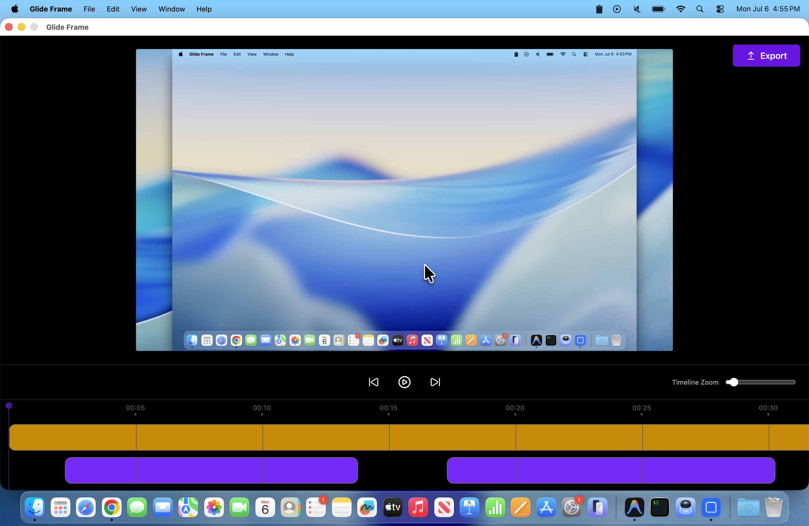
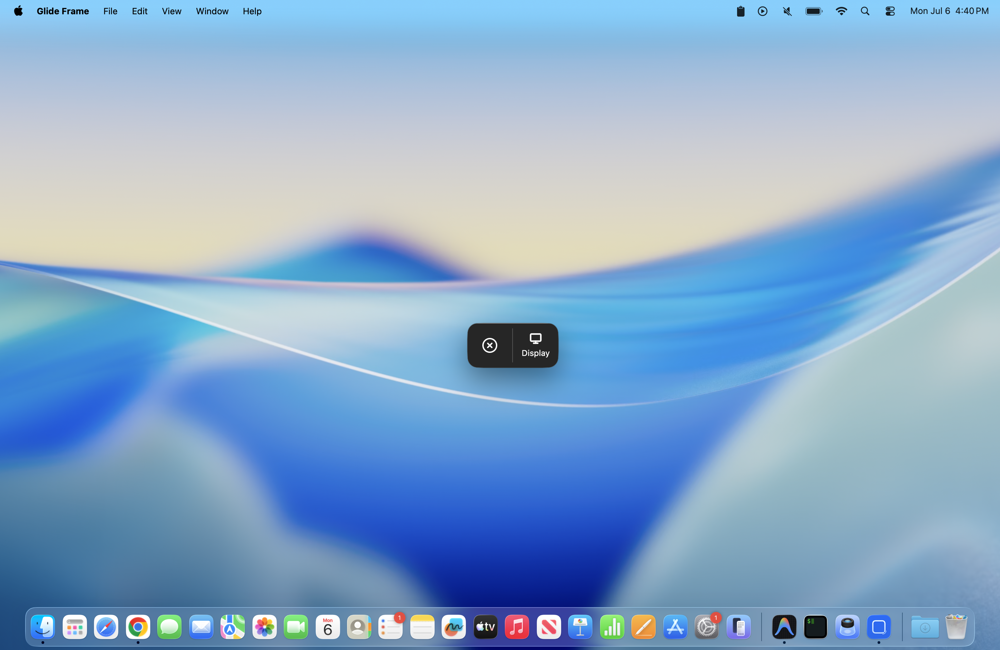
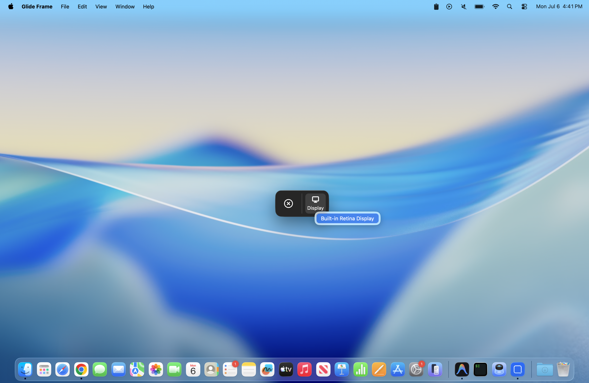
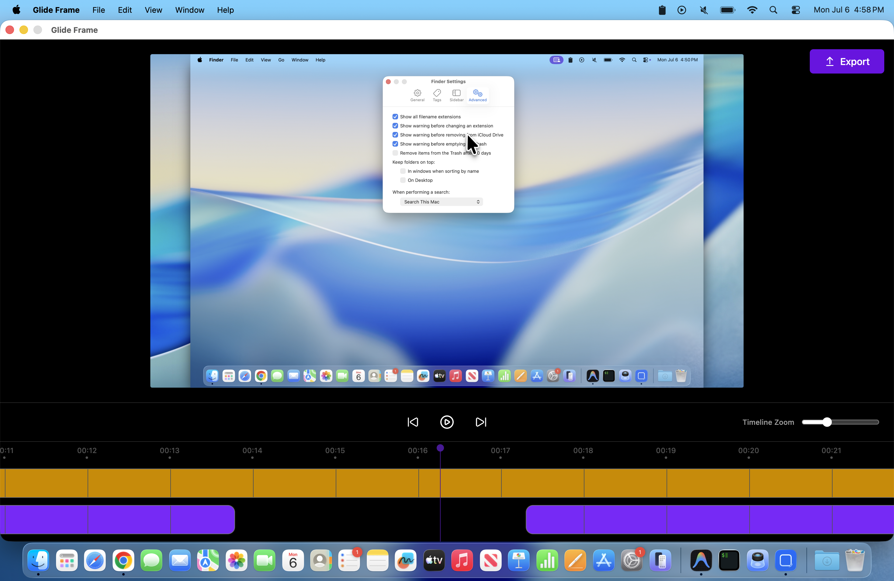
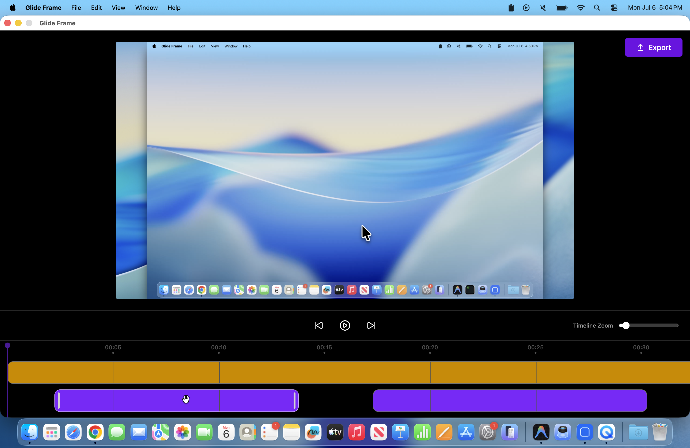
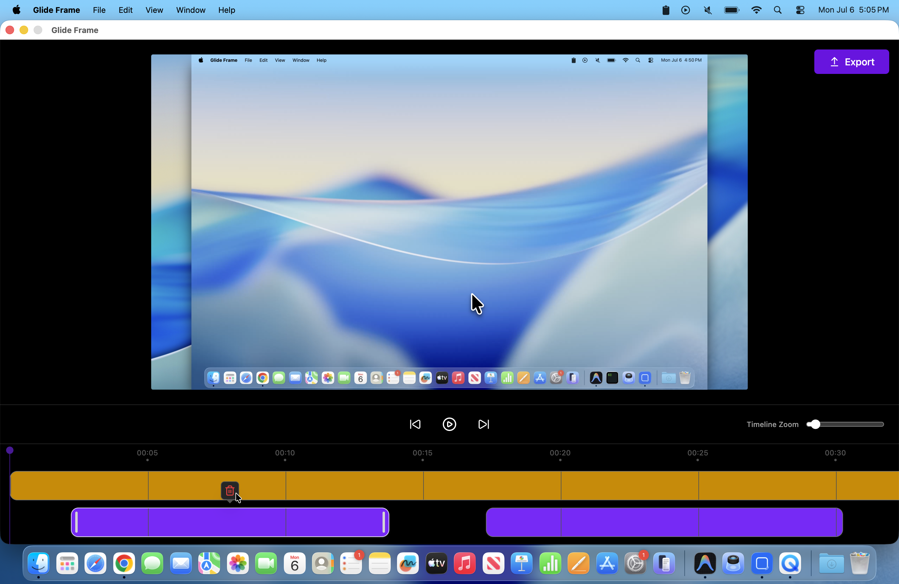
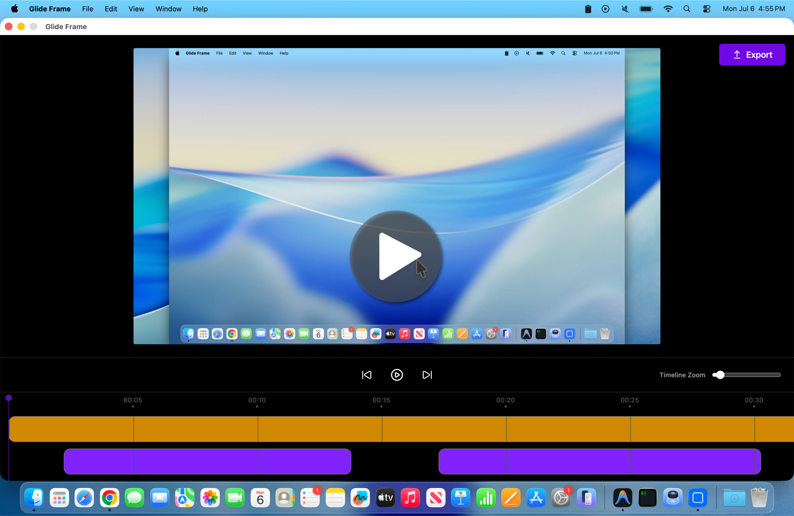
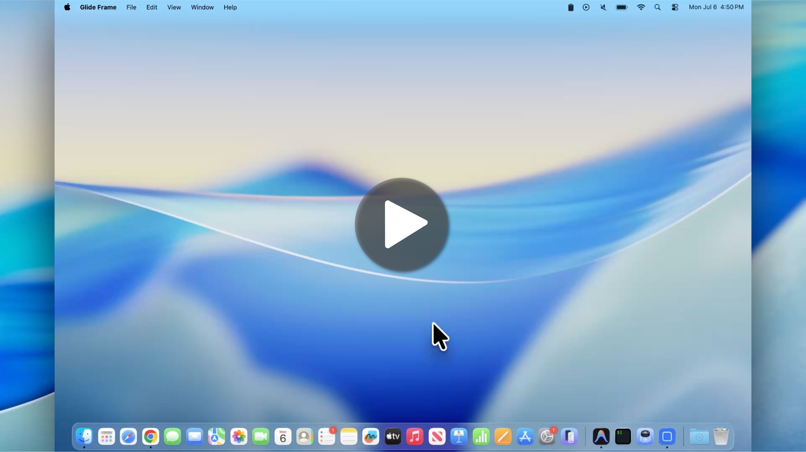
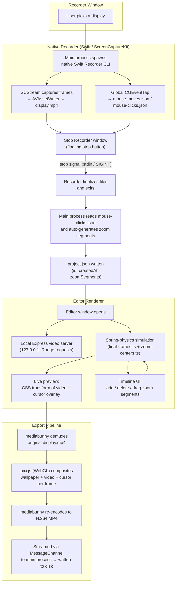

<div align="center">

  

# Glide Frame

**Beautiful screen recordings, with buttery-smooth zoom and cursor animations - for free.**

[](LICENSE)
[](/)
[](https://www.electronjs.org/)

</div>

---

## Why Glide Frame?

I like **[Screen Studio](https://screen.studio/)** - it turns a plain screen recording into something that looks like a polished product demo, almost entirely on autopilot. But it's a paid subscription, and I wanted the same experience to be free, open source, and hackable.

**Glide Frame** is my attempt at that: a native macOS app that records your screen, automatically figures out where and when to zoom in based on your clicks, smoothly follows your cursor while zoomed, and renders everything with spring-physics-based animations - then lets you fine tune all of it in a proper timeline editor before exporting a final video.

No subscriptions. No watermarks. No cloud upload. Everything happens locally on your machine.

---

## ✨ Product Showcase

<div align="center">
    
</div>

### Core Features

- 🖥️ **One-click screen recording** — pick any connected display and start recording instantly.
- 🎯 **Automatic zoom segments** — Glide Frame analyzes your mouse-click activity after recording and automatically proposes zoom-in segments around bursts of activity, so you don't start from a blank timeline.
- 🧲 **Cursor-aware zoom** — while zoomed in, the camera smoothly follows your cursor, staying within a "safe zone" so it doesn't jitter on every tiny movement.
- 🖱️ **Polished cursor overlay** — an oversized, soft-shadowed cursor with a subtle "squish" animation on click and a natural tilt driven by movement velocity.
- 🌊 **Spring-physics animation everywhere** — zoom, pan, and cursor motion are all driven by a mass/stiffness/damping spring simulation instead of fixed-duration easing curves, so motion always feels natural regardless of distance or speed.
- 🎬 **Full timeline editor** — scrub, zoom the timeline in/out, and add, delete, resize, or drag zoom segments with pixel-accurate control.
- 📤 **Local, GPU-rendered export** — exports a final MP4 with all zoom/cursor animations baked in, rendered frame-by-frame on the GPU and streamed straight to disk.

### Screenshots

<div align="center">
    
    
    
</div>

<div align="center">
    
    
    
</div>

### Product Demo Video

<div align="center">
  <a href="https://drive.google.com/file/d/1-T5gCvB429mEb4IZILYc8wSkewJ0OnSN/view?usp=sharing">
    
  </a>
</div>

### Sample Exported Video

Here's an example of a raw recording exported straight out of Glide Frame, zoom, pan and cursor animations included:

<div align="center">
  <a href="https://drive.google.com/file/d/1JadGD8Wg7TS0HvGsHi8eQQ-OE3MHNsN_/view?usp=sharing">
    
  </a>
</div>

---

## 📦 Installation

Glide Frame currently targets **macOS 14 (Sonoma) or later**, since recording is built on Apple's [ScreenCaptureKit](https://developer.apple.com/documentation/screencapturekit).

1. Go to the [Releases](../../releases) page and download the latest `.dmg` for macOS.
2. Open the `.dmg` and drag **Glide Frame** into your `Applications` folder.
3. Launch the app. Since builds aren't notarized yet, macOS Gatekeeper may block the first launch — right-click the app in Finder and choose **Open**, then confirm.
4. On first run, Glide Frame will ask for two permissions:
   - **Screen Recording** — required to capture the display.
   - **Accessibility / Input Monitoring** — required to track global mouse movement and clicks so zoom segments and the cursor overlay can be generated.
5. Grant both permissions in **System Settings → Privacy & Security**, then restart the app.

---

## 🏗️ System Architecture

Glide Frame is an Electron app with three lightweight renderer windows (recorder pill, stop button, editor) driven by a Node.js main process, paired with a native Swift command-line helper that does the actual screen and input capture. Recording and editing are split into two clearly separated phases:

**Recording phase** — the main process spawns a native `Recorder` CLI process built on ScreenCaptureKit + a global `CGEventTap`. It writes the captured video and raw input events straight to disk as the recording happens.

**Editing phase** — once recording stops, the app parses the click data into candidate zoom segments, opens the editor, and simulates a spring-physics timeline in the renderer to drive both the live preview and the final GPU-rendered export.



A few implementation details worth calling out:

- **Why a native Swift CLI instead of Electron's built-in `desktopCapturer`?** ScreenCaptureKit gives per-display 60 fps capture at full retina resolution alongside precise frame timestamps, which are used to align the mouse event stream with the video down to the millisecond.
- **Why a local Express server for video playback?** Streaming the recorded MP4 to the `<video>` element over `http://127.0.0.1` (bound to localhost only) gives free, correct HTTP Range support for scrubbing large recordings, which is awkward to replicate with custom Electron protocols.
- **Why spring physics instead of keyframe easing?** Every animated value (zoom scale, pan position, cursor position/scale/rotation) is modeled as a damped spring (`mass`, `stiffness`, `damping`) stepped at a fixed timestep. This means the exact same simulation code drives the real-time preview _and_ the frame-by-frame export, so what you see while editing is exactly what you get in the exported file — regardless of how far or fast the camera has to move.
- **Why pixi.js for export?** Export re-renders every frame through a WebGL scene graph (background, video, drop shadows, cursor + cursor shadow) so the exported video is pixel-identical to the live preview, then hands the composited canvas to `mediabunny` for encoding and muxing.

---

## 🧰 Tech Stack

| Layer                       | Technology                                                                                                                               |
| --------------------------- | ---------------------------------------------------------------------------------------------------------------------------------------- |
| App shell                   | [Electron](https://www.electronjs.org/) 39, [electron-vite](https://electron-vite.org/), [electron-builder](https://www.electron.build/) |
| UI                          | [React 19](https://react.dev/), TypeScript, [Tailwind CSS 4](https://tailwindcss.com/), [lucide-react](https://lucide.dev/)              |
| Native screen/input capture | Swift 6, [ScreenCaptureKit](https://developer.apple.com/documentation/screencapturekit), AVFoundation, CoreGraphics (`CGEventTap`)       |
| Video decode / encode       | [mediabunny](https://www.npmjs.com/package/mediabunny)                                                                                   |
| GPU frame compositing       | [pixi.js](https://pixijs.com/) (WebGL)                                                                                                   |
| Tooling                     | ESLint (`@electron-toolkit`), Prettier                                                                                                   |

---

## 🔨 How to Build Manually

> Requires macOS 14+, [Node.js](https://nodejs.org/) 20+, and Xcode with Swift 6.3 toolchain support (for the native `Recorder` helper).

```bash
# 1. Install JS dependencies
npm install

# 2. Build the native Swift screen/input recorder (macOS only)
npm run build:swift

# 3. Build and package the app for your platform
npm run build:mac    # macOS (.dmg / .app)
```

Packaged artifacts are written to `dist/`. `npm run build:mac` runs the Swift build, the TypeScript build, and `electron-builder` in sequence; the native `Recorder` binary is bundled as an extra resource inside the app (see `electron-builder.yml`).

---

## 🧪 Local Development Setup

```bash
# 1. Clone the repo
git clone https://github.com/abhignakumar/glide-frame.git
cd glide-frame

# 2. Install dependencies
npm install

# 3. Build the native Recorder CLI once (macOS only — required before recording works in dev)
npm run build:swift

# 4. Start the app in development mode (hot reload for the renderer)
npm run dev
```

Useful scripts while developing:

```bash
npm run typecheck   # TypeScript project-reference type checking (main + web)
npm run lint        # ESLint
npm run lint:fix     # ESLint with autofix
npm run format       # Prettier write
npm run format:check # Prettier check
npm run check        # typecheck + lint + format:check, all in one
```

On first dev launch, macOS will prompt for **Screen Recording** and **Accessibility / Input Monitoring** permissions — grant both to your terminal/IDE (or the Electron dev binary) and restart `npm run dev`.

Project structure at a glance:

```
src/
├─ main/            # Electron main process: window management, IPC, video server, zoom-segment generation
├─ preload/         # Context-isolated preload scripts, one per window
└─ renderer/
   └─ src/windows/
      ├─ recorder/       # Small floating "pick a display" pill window
      ├─ stop-recorder/  # Floating stop button shown while recording
      └─ editor/         # Timeline editor, spring-physics preview, and export pipeline

native/Recorder/     # Swift package: ScreenCaptureKit capture + global mouse tracking CLI
```

---

## 📄 License

Glide Frame is licensed under the [MIT License](LICENSE).
